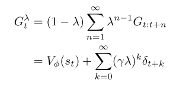

# Soft policy optimization using dual-track advantage estimator

## Current issues
- model-free RL are sample inefficiency, require tons of samples
- difficult to converge and sensititve to hyper-parameters

## Contribution
- Entropy term balance the exploration and exploitation (soft policy optimization). Explore more states in the initial stage, and exploit explored policy to find more returnable trajectories
- Combine TD learning (faster convergence) and GAE (reduce variance)

## Method

α is update coefficient

### TD advantage estimator (TDAE)

TDAE (equation 11) contains both value from value network and TD => TDAE is more varied than GAE  
Hyperparams: alpha, lambda, gamma

### Dual-track advantage estimator (DTAE)
In early stage, the agent tends to adpot the action with higher randomness rather than action with maximal return predicte by current policy. So the increment speed of return is slow, the solution is increate the convergence speed of value function.

??? Why TDAE is based on previous policy  

## References:
https://julien-vitay.net/deeprl/BasicRL.html#sec:temporal-difference
https://github.com/Code-Papers/SPOD     